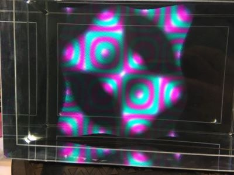

HoloPlay Core Example Project
===
This is an example project that shows how to use [HoloPlay Core](https://docs.lookingglassfactory.com/HoloPlayCore/) to build a crossplatform holographic renderer for a Looking Glass display. It is based on [OpenGL CMake Skeleton](https://github.com/ArthurSonzogni/OpenGL_CMake_Skeleton) by Arthur Sonzogni, and depends on [GLFW](https://github.com/glfw/glfw/), [GLEW](https://github.com/omniavinco/glew-cmake/), and [glm](https://github.com/g-truc/glm).

## Table of Contents
 * [Setup](#setup)
   - [Clone with Submodules](#clone-with-submodules)
   - [Installing CMake and Dependencies](#installing-cmake-and-dependencies)
   - [Build](#build)
      - [Linux](#linux)
      - [Windows](#windows)
      - [macOS](#macos)
   - [Run](#run)
 * [Rendering Holograms with the Looking Glass](#rendering-holograms-with-the-looking-glass)
    * [Introduction](#introduction)
    * [Key Steps](#key-steps)
      * [Initialization](#initialization--holoplaycontextholoplaycontext)
      * [Render Loop](#rendering--holoplaycontextrun)
      * [On Exit](#on-exit--holoplaycontextonexit)
      * [Set Up Virtual Camera](#set-up-virtual-camera--holoplaycontextsetupvirtualcameraforview)
    * [More References](#more-references)
 * [Project Structure](#project-structure)
 * [Making Use of HoloPlay Core](#making-use-of-holoplay-core)
   * [Setup and Teardown](#setup-and-teardown)
   * [Shader related](#shader-related)
   * [Monitor Coordinates](#monitor-coordinates)
   * [View cone](#view-cone)
   * [Debug mode](#debug-mode)
   * [Other info](#other-info)
 * [Dependencies](#dependencies)
 * [Sources](#sources)

## Setup

### Clone with submodules

```bash
git clone --recursive https://github.com/Looking-Glass/HoloPlayCoreSDK.git
```

If you already have the repository and didn't use the `--recursive` option, you can type:
```bash
git submodule update --init --recursive
```

### Installing CMake and Dependencies

Follow [these instructions](https://cmake.org/install/) or use your preferred command-line package manager to download and install the latest version of CMake.  

If using a graphical installer on Windows or macOS, make sure to check "Add CMake to the system PATH".

[This document](https://cliutils.gitlab.io/modern-cmake/) has more helpful background on what CMake is and how to use it.

### Build

#### Linux
First you will need to install the project dependencies:
```bash
sudo apt-get install cmake libxrandr-dev libxinerama-dev libxcursor-dev libxi-dev
```
Open the directory into a terminal:
```bash
cd ExampleProject
mkdir build
cd build
cmake ..
cmake --build .
./main
```

#### Windows
* Open the project with CMake GUI
* Configure (you have several options here depending on whether you wish to use the command line or an IDE for development)
* Generate
* Use IDE or command line to build
* Run the build (normally at `Debug\main.exe`)

Or, open the directory into a terminal:

```batchfile
cd ExampleProject
mkdir build
cd build
cmake ..
cmake --build .
Debug\main.exe
```

#### macOS
* Open the project with CMake GUI
* Configure (Xcode or "Unix Makefiles" both work fine)
* Generate
* Use IDE or command line to build
* Run the build (normally at `Debug/main`)

Or in command line:

Or, open the directory into a terminal:
```bash
cd ExampleProject
mkdir build
cd build
cmake ..
cmake --build . --target install/cmake --build .
Debug/main
```
### Run

#### Controls

**WASD** or mouse to move the camera
Scroll to zoom in and out

Press **SPACE** to show the quilt in debug mode (this displays a 2D quilt image)

Press **ESC** to quit

#### Preview



#### Troubleshooting

If the app aborts or shuts down immediately:
1. Verify that [HoloPlay Service](look.glass/holoplayservice) is installed and running. The HoloPlay Service icon should display in the taskbar, if running properly. If it is not installed, install it, and if it is not displaying in the taskbar, run it manually.
2. Right-click on the taskbar icon. This opens a menu that shows information about your connected Looking Glass display. Make sure it detects your device and its calibration. If not, right-click on the icon to restart HoloPlay Service until it detects both the device and its calibration. Double check if your Looking Glass is plugged in a USB3.0 port. If you have any problems achieving this, please [email us](https://lookingglassfactory.com/contact) or report the bug in our [forum](https://forum.lookingglassfactory.com/?_ga=2.171851938.388081720.1583171731-2126388208.1558451460) or [Discord server](https://discord.gg/ZW87Y4m).

## Rendering Holograms with the Looking Glass

### Introduction
First, it may be helpful to know how the Looking Glass works. In order to display holograms, the Looking Glass takes **45 discrete views** of a 3D scene and presents them across a view cone roughly 40° wide.  

The simplest way to create these views is to render a 3D scene 45 times per frame, varying the camera position each time, then combine all views into a single texture called a **quilt**. In OpenGL, we save each view with a **framebuffer** and use a **blit shader** to copy it into its designated position in the quilt.

To show the views simultaneously, we use a **light field shader** to scramble the pixels in the quilt, making it appear as a 3D hologram when viewed through the Looking Glass.

Each Looking Glass display has a unique set of **calibration** values, which describe its optical properties. These are converted to **uniforms** (values passed from the CPU to the GPU at runtime) for the light field shader. Calibration values are read over USB by **HoloPlay Service**.

For the calibration to apply correctly, the rendering context must be perfectly aligned to the display. Your application can achieve this by creating a fullscreen, undecorated window. In this example we will use the GLFW library to create our window.

Doing this correctly can be tricky - some graphics libraries may create windows with invisible decorations. If your hologram appears 'miscalibrated', you may wish to use a tool like [NirSoft WinLister](https://www.nirsoft.net/utils/winlister.html) (Win32) or [xwininfo](https://linux.die.net/man/1/xwininfo) (Linux) to verify that your window has been opened with the correct properties. 

HoloPlay Core provides the source code for the light field shader as well as an interface to access the calibration values and exact window positions for each connected Looking Glass. 

This has been a brief overview of a complex process. For a more in-depth explanation of quilts, light fields, virtual camera setup, and the principles behind Looking Glass technology, please check out [More References](#more-references).

### Key Steps

To recap, the key steps to display a hologram are:

#### Initialization &#8594; ``HoloPlayContext::HoloPlayContext()``

 1. Open connection to **HoloPlay Service**; retrieve window and calibration parameters &#8594; ``HoloPlayContext::HoloPlayContext()``
 2. Open a **full-screen window** on the Looking Glass &#8594; ``HoloPlayContext::openWindowOnLKG()``
 3. Compile **blit shaders** &#8594; ``HoloPlayContext::loadBlitShaders()``
 4. Create and configure **light field** shader:
       - Compile light field shader from provided GLSL &#8594; ``HoloPlayContext::loadLightFieldShaders()``
       - Request calibration &#8594; ``HoloPlayContext::loadLightFieldShaders()``
       - Configure **quilt settings** &#8594; ``HoloPlayContext::setupQuiltSettings()``
       - Pass them to the light field shader &#8594; ``HoloPlayContext::passQuiltSettingsToShader()``
 5. Allocate and configure quilt &#8594; ``HoloPlayContext::setupQuilt()``
 6. Allocate and configure **view texture** and **view framebuffer** targets &#8594; ``HoloPlayContext::setupViewTextureAndFrameBuffer()``
 
#### Rendering &#8594; ``HoloPlayContext::run()``

 1. Update scene logic (i.e., physics) &#8594; ``HoloPlayContext::update()``
 2. For each view in the quilt:
    - Bind view framebuffer to view texture
    - [Set up virtual camera](#set-up-virtual-camera--holoplaycontextsetupvirtualcameraforview) &#8594; ``HoloPlayContext::setupVirtualCameraForView()``
    - Render the scene into the view framebuffer &#8594; ``HoloPlayContext::renderScene()``
    <!-- TODO: mention that it's necessary for the override of renderScene() to use the provided projection matrix -->
    <!-- TODO: replace the original step 4 from this documentation if necessary -->
    - Use the blit shader to copy the view texture into the quilt texture &#8594; ``HoloPlayContext::copyViewToQuilt()``
 3. Draw the quilt: render the quilt texture to the default framebuffer using the light field shader ``HoloPlayContext::drawLightField()``
 4. Enjoy your hologram in the Looking Glass!

#### On Exit &#8594; ``HoloPlayContext::OnExit()``
 1. Free the ``HoloPlayContext`` objects created &#8594; `HoloPlayContext::release()`
 2. Release the connection to HoloPlay Service &#8594; `hpc_closeApp()`

#### Set Up Virtual Camera &#8594; ``HoloPlayContext::setupVirtualCameraForView()``
 Here's an illustration of the way the camera position changes each frame:

![alt text][view-cone]

[view-cone]:https://docs.lookingglassfactory.com/HoloPlayCore/images/viewcone.png "camera moves on the red track"

<!-- TODO: explain exactly what is happening in this animation in greater detail.
* How does the projection matrix change?
* What is the middle section illustrating - top down view of looking glass?
* Describe how this code fits into the previous breakdown of the rendering functions - this isn't code the user has to write in order to leverage the sample project; we're explaining how it works under the hood.
-->
The projection matrix also shifts between views. Here is an animation showing those changes: 
 ![alt text][quilt_format2]

[quilt_format2]:https://docs.lookingglassfactory.com/Appendix/images/multiplex.gif "quilt - top-down view of Looking Glass - single view"

So we calculate the position and projection offsets and then change the projection matrix:
```c++
// set up the camera with the view and the shader of the rendering object
void HoloPlayContext::setupVirtualCameraForView(int currentViewIndex, glm::mat4 currentViewMatrix) {
  // field of view should be 14 degrees according to physical measurement
  const float fov = glm::radians(14.0f);
  // calculate the camera distance, which is actually static when camera size stays the same
  float cameraDistance = -cameraSize / tan(fov / 2.0f);
  // start at -viewCone * 0.5 and go up to viewCone * 0.5
  float offsetAngle = (currentViewIndex / (qs_totalViews - 1.0f) - 0.5f) * glm::radians(viewCone);  
  // calculate camera displacement offset
  float offset = cameraDistance * tan(offsetAngle);

  // move the camera by offset and camera distance in x and z directions
  viewMatrix = glm::translate(currentViewMatrix, glm::vec3(offset, 0.0f, cameraDistance));

  float aspectRatio = getWindowRatio();
  // main projection matrix stays the same
  projectionMatrix = glm::perspective(fov, aspectRatio, 0.1f, 100.0f);
  // change the projection matrix to be parallel
  projectionMatrix[2][0] += offset / (cameraSize * aspectRatio);
}
```
If you want to further understand how these equations work, check out [Offset](https://docs.lookingglassfactory.com/HoloPlayCore/guides/camera/#offset).

### More References
  - [How the Looking Glass Works](https://docs.lookingglassfactory.com/Appendix/how-it-works/)
  - More about [Quilts](https://docs.lookingglassfactory.com/HoloPlayCore/guides/quilt/)
  - More about [Camera Setup](https://docs.lookingglassfactory.com/HoloPlayCore/guides/camera/)
  <!--
  TODO: figure out what to replace this with, it's been removed from the doc site
  - More about [light fields](https://docs.lookingglassfactory.com/HoloPlayCAPI/guides/lightfield/)
  -->

  <!--
  TODO: One thing I found really confusing was the differences between the various functions to change the view matrix.
  For instance, I'm not sure GetCurrentViewMatrix even exists any more.
  -->

## Project Structure
When starting a new project, you can use this example project as a template.  Begin by rendering your own scene in `SampleScene::renderScene`, then change how the camera updates in `SampleScene::GetCurrentViewMatrix` and reimplement control functions for customization. Here is a list of all the virtual functions in the `SampleScene` class:
 ```c++
  virtual void renderScene(); // render scene here
  virtual glm::mat4
      GetCurrentViewMatrix();  // define how view matrix gets updated each frame here.
                               // projection matrix is not changeable because
                               // the field of view is static according to hardware measurement
  virtual bool processInput(GLFWwindow* window);  // all key inputs
  virtual void mouse_callback(GLFWwindow* window, double xpos, double ypos);
  virtual void scroll_callback(GLFWwindow* window,
                               double xoffset,
                               double yoffset);
 ```

If you have an existing 3D app and you want to bring it in the Looking Glass, please refer to how the HoloPlay Context is [initialized](#initialization--holoplaycontextholoplaycontext) and [released](#on-exit--holoplaycontextonexit), [how the camera changes for 45 views](#set-up-virtual-camera), and [how to copy views to the quilt](#rendering--holoplaycontextrun) in the example project. Then, build up the same context in your project. We recommend reading the section below for more detailed instructions.

  <!--
  TODO: It may be best to keep comprehensive documentation on how HoloPlay Core itself works in a separate place - starting from the function descriptions that currently exist as comments in HoloPlayCore.h.
  Not sure where that should live yet - we may be fine to leave some of this stuff out for now. Open to suggestions.
  -->

## Making Use of HoloPlay Core 
### Setup and Teardown 
 * Release: `int hpc_CloseApp();`
 * Setup: `hpc_client_error hpc_InitializeApp(const char *app_name)`
   
### Shader related
 * Shader source code ``hpc_LightfieldVertShaderGLSL`` & ``hpc_LightfieldFragShaderGLSL``
 * Shader Uniforms
 ```c++
void HoloPlayContext::loadCalibrationIntoShader() {
  std::cout << "begin assigning calibration uniforms" << std::endl;
  lightFieldShader->use();
  lightFieldShader->setUniform("pitch", hpc_GetDevicePropertyPitch(DEV_INDEX));
  lightFieldShader->setUniform("tilt", hpc_GetDevicePropertyTilt(DEV_INDEX));
  lightFieldShader->setUniform("center", hpc_GetDevicePropertyCenter(DEV_INDEX));
  lightFieldShader->setUniform("invView", hpc_GetDevicePropertyInvView(DEV_INDEX));
  lightFieldShader->setUniform("quiltInvert", 0);
  lightFieldShader->setUniform("subp", hpc_GetDevicePropertySubp(DEV_INDEX));
  lightFieldShader->setUniform("ri", hpc_GetDevicePropertyRi(DEV_INDEX));
  lightFieldShader->setUniform("bi", hpc_GetDevicePropertyBi(DEV_INDEX));
  lightFieldShader->setUniform("displayAspect",hpc_GetDevicePropertyDisplayAspect(DEV_INDEX));
  lightFieldShader->setUniform("quiltAspect", hpc_GetDevicePropertyDisplayAspect(DEV_INDEX));
  lightFieldShader->unuse();
}
 ```
### Monitor Coordinates
 ```c++
 GLFWwindow* HoloPlayContext::openWindowOnLKG() {
  ...
  // get window coordinates
  win_w = hpc_GetDevicePropertyScreenW(DEV_INDEX);
  win_h = hpc_GetDevicePropertyScreenH(DEV_INDEX);
  win_x = hpc_GetDevicePropertyWinX(DEV_INDEX);
  win_y = hpc_GetDevicePropertyWinY(DEV_INDEX);
  // open the window
  auto mWindow = glfwCreateWindow(win_w, win_h, "Looking Glass Output", NULL, NULL);
  glfwSetWindowPos(mWindow, win_x, win_y);
  return mWindow;
}
 ```
### View cone 
 ```c++
 float viewCone = hpc_GetDevicePropertyFloat(i, "/calibration/viewCone/value")
 ```
### Debug mode 
 ```c++
 quiltShader->setUniform("debug", 1); // turn off by setting "debug" to 0
 ```
### Other info

Check in `HoloPlayContext::GetLookingGlassInfo`:
 ```c++
  hpc_GetHoloPlayCoreVersion(buf, 1000);
  hpc_GetHoloPlayServiceVersion(buf, 1000);
  int num_displays = hpc_GetNumDevices();
  hpc_GetDeviceHDMIName(i, buf, 1000);
  hpc_GetDeviceType(i, buf, 1000);
 ```
  <!--
  TODO:  I'm leaving stuff after this untouched, but I'm not sure if some of it is necessary any more. I moved the details about the dependencies and project credits to the top of this document. I think the overview of HoloPlayContext and SampleScene should be earlier in the document.
  -->

## Dependencies
This project is created with:
* HoloPlay Core
* GLFW
* GLEW
* glm

Shader class and example scene are included.

HoloPlayContext: a class that sets up the context for rendering holograms onto the Looking Glass.

SampleScene: inherits from HoloPlayContext. Overrides camera update, scene render and control functions in HoloPlayContext.

It compiles on:
 * Linux
 * Windows
 * Mac

## Sources
This example project is built on Arthur Sonzogni's [OpenGL CMake Skeleton](https://github.com/ArthurSonzogni/OpenGL_CMake_Skeleton).
